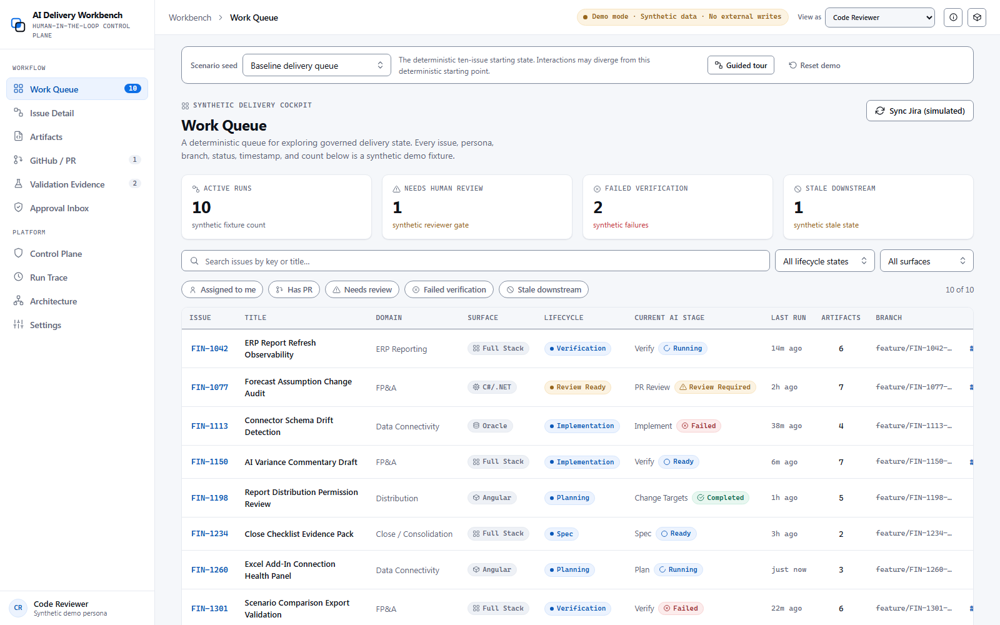

# AI Delivery Workbench

> A governed, human-in-the-loop control plane for AI-assisted software delivery.

AI Delivery Workbench shows how coding-agent output can remain subordinate to explicit context, authorization, approval, validation, budget, and evidence controls.

- **Intended Production origin:** `https://tylerwilhite.dev`.
- **Intended Workbench URL:** `https://tylerwilhite.dev/workbench/`. The domain and path are configuration targets, not evidence that v1.0.8 Production deployment, DNS/TLS, canonical metadata, or Production verification has succeeded.
- **Verified Preview baseline:** [immutable v1.0.7 Preview](https://ai-delivery-workbench-e7sfli7i9-workbench1.vercel.app/), bound to the v1.0.7 evidence commit. It is a Preview artifact, not Production and not v1.0.8.
- **v1.0.8 candidate:** this repository source. Fresh hosted CI, CodeQL, release evidence, Preview, and Production verification belong to the later release procedure and are not inherited from v1.0.7.
- **Source:** [github.com/sorren1/AIWorkbench](https://github.com/sorren1/AIWorkbench)
- **Local routes:** case study at `/`, technical article at `/writing/governing-ai-assisted-delivery/`, and interactive prototype at `/demo/`.
- **Hosted route contract:** the portfolio index occupies `/`; Vercel maps the full case study, article, and prototype beneath `/workbench/` and permanently redirects legacy public page routes into that namespace.



The repository is an independent portfolio prototype: a statically rendered case study, a strict-TypeScript React workbench, and an explicitly invoked local sandbox that records one narrow real validation run against repository-owned synthetic code. The public website has no backend, credentials, live integrations, or code-execution endpoint.

## What is functional and what is simulated

| Functional in this repository                                                                                                                                                                                                                                                                                                                                                                                                                                | Simulated or recorded-only in the public browser                                                                                                                                                                                                                                                                                                     |
| ------------------------------------------------------------------------------------------------------------------------------------------------------------------------------------------------------------------------------------------------------------------------------------------------------------------------------------------------------------------------------------------------------------------------------------------------------------ | ---------------------------------------------------------------------------------------------------------------------------------------------------------------------------------------------------------------------------------------------------------------------------------------------------------------------------------------------------- |
| Static case study and article; React demo navigation; deterministic scenarios and reset; deep links; reducer-backed stage transitions and stale-state propagation; artifact copy/download/export; keyboard-accessible guided tour; browser-local synthetic approval journal; versioned registry, policy, context-pack, budget, and trace contracts; checked-in evidence validation; developer-invoked Docker sandbox; deterministic offline gateway adapter. | Jira and GitHub reads/writes; LLM generation; database access; enterprise MCP operations; deployment; hosted validation; production identity; shared approvals; provider billing; the recorded sandbox and trace viewer. E2B and LiteLLM adapters are implemented but were not live-validated in this revision because credentials were unavailable. |

Every persona, issue, repository, branch, pull request, check, log, duration, UI metric, and external response displayed as demo data is synthetic. The local sandbox evidence is separately labeled as a measured repository run.

## Architecture at a glance

The design separates four responsibilities:

- **Control Plane** — versioned agents/tools, workflow state, scoped authorization, approvals, budgets, and lifecycle policy.
- **Execution Plane** — bounded tool adapters and an optional local sandbox provider operating only on a disposable toy repository.
- **Context Plane** — deterministic context records and packs with provenance, exclusions, freshness, policy versions, and digests.
- **Validation Plane** — changed-file checks, command results, review gates, trace/evidence binding, and release-readiness decisions.

Normal branch, pull-request, and human-review controls remain authoritative. A stage cannot grant itself new tools, broaden its selected context, approve its own risky operation, or declare release readiness without the required evidence.

Read [ARCHITECTURE.md](ARCHITECTURE.md) for the full system model and [docs/decision-log.md](docs/decision-log.md) for the decision history.

## Run locally

Prerequisites are Node.js 22 LTS and npm. Docker is required only for generating sandbox and supply-chain evidence.

```bash
npm ci
npm run dev
```

Vite prints the local URL. Open `/` for the case study or `/demo/` for the interactive prototype. Open `/demo/?walkthrough=principal&tourStep=thesis` to start the accessible, interruption-safe seven-minute principal/staff walkthrough. The presenter script, 60-second summary, and 15-minute deep dive are in [`docs/interview-walkthrough.md`](docs/interview-walkthrough.md).

Build and inspect the production output:

```bash
npm run build
npm run preview
```

Run the normal source gate or the complete browser/performance release gate:

```bash
npm run check
npm run check:all
```

Install browser engines once before the complete gate:

```bash
npx playwright install chromium firefox webkit
```

Generate or verify the seven public case-study/demo captures and social image:

```bash
npm run screenshots:generate
npm run screenshots:check
```

The generator uses the production preview, reduced motion, pinned Chromium, repository-owned
fixtures, and the authored SVG social-card source. The check decodes the committed images and fails
on material pixel drift while allowing only a documented one-value browser antialias tolerance.

Run the fixed failing-before/passing-after Docker slice and validate its evidence:

```bash
npm run demo:sandbox
npm run sandbox:evidence:validate
```

The CLI accepts no visitor repository, patch, or command input. It copies `examples/toy-repo`, applies one checked-in patch to an approved path, runs fixed commands in constrained network-disabled containers, cleans up, and writes hash-bound JSON, Markdown, and trace evidence.

See [CONTRIBUTING.md](CONTRIBUTING.md) and [docs/contributor-commands.md](docs/contributor-commands.md) for the command matrix, optional provider profiles, and focused test commands.

## Tests and release gates

`npm run check:all` covers formatting, lint, strict type checking, registry/context/evidence drift, unit and component coverage, production build, static and documentation links, bundle budgets, credential-pattern checks, supply-chain evidence, Chromium/Firefox/WebKit end-to-end tests, axe checks, controlled visual captures, and desktop/mobile Lighthouse assertions.

The supply-chain gate adds redacted tracked-file/history secret scanning, TypeScript/JavaScript analysis, dependency and container vulnerability scans, five CycloneDX SBOMs, license policy, suppression validation, and sanitized source-linked evidence. Missing Docker, scanners, advisory data, or history fails the gate rather than becoming a pass. Hosted CodeQL is release-specific: v1.0.7 has generated zero-finding evidence for its audited source, while v1.0.8 must produce fresh hosted evidence before its own summary, tag, or deployment can be accepted.

Read [EVALUATION.md](EVALUATION.md), [SECURITY.md](SECURITY.md), [THREAT_MODEL.md](THREAT_MODEL.md), and [docs/release-evidence.md](docs/release-evidence.md) for claim definitions and assurance limits.

## Release and deployment evidence

The durable v1.0.7 Preview record is its [generated deployment binding](https://ai-delivery-workbench-e7sfli7i9-workbench1.vercel.app/security/deployment-binding.json) plus its [generated release summary](https://ai-delivery-workbench-e7sfli7i9-workbench1.vercel.app/security/release-summary.json). Those generated records bind release tag, audited source, evidence commit, deployed commit, and hosted CodeQL result without relying on a hand-maintained run table.

The v1.0.8 audited source intentionally contains no `public/security/release-summary.json`. After fresh local and hosted gates pass, the release process creates one direct evidence child containing only that generated file, tags that child, and produces a new deployment binding. The intended stable Workbench URL is `https://tylerwilhite.dev/workbench/`; it becomes Production evidence only after the Production gate in [docs/deployment-verification.md](docs/deployment-verification.md) succeeds at `https://tylerwilhite.dev`.

## Repository map

| Path                                          | Purpose                                                                         |
| --------------------------------------------- | ------------------------------------------------------------------------------- |
| `home/index.html`                             | Static portfolio index served at the Production origin                          |
| `index.html`, `writing/`, `404.html`          | Static Workbench case study, article, and shared not-found page                 |
| `demo/index.html`, `src/demo/`                | Interactive React workbench, screens, state, data, and control-plane contracts  |
| `src/case-study/`, `src/site/`                | Shared public styling plus typed metadata/link configuration                    |
| `src/styles/tokens/`, `src/shared/`           | Authored semantic tokens and local SVG icon system                              |
| `examples/toy-repo/`                          | Disposable original synthetic code and tests for the controlled patch slice     |
| `tools/local-sandbox/`                        | Sandbox contract, Docker/E2B adapters, controls, tracing, budgets, and evidence |
| `tools/model-gateway/`, `ops/model-gateway/`  | Offline/live gateway contracts and optional local LiteLLM profile               |
| `public/capabilities/`, `evidence/generated/` | Generated, validated public registry/context and latest recorded run evidence   |
| `tests/`, `quality/`, `scripts/`              | Unit/browser tests, measured baselines, and deterministic generators/checkers   |
| `docs/`, `docs/adr/`                          | Architecture details, runbooks, audits, release evidence, and decisions         |

## Limitations and production boundaries

This repository is not a multi-tenant agent platform, anonymous execution service, production identity system, durable shared approval service, hosted telemetry backend, high-availability model gateway, or proof of safe untrusted-code execution. Browser-local state is inspectable and resettable but not tamper-resistant. Hashes detect evidence changes; they are not signatures or trusted timestamps. Docker isolation still trusts the host kernel and daemon. Optional cloud/model adapters need owner-supplied credentials and separate live validation.

Productionization would require authenticated workload and human identity, server-side authorization, managed secrets, isolated workers, durable transactional state, signed/immutable evidence, controlled egress, incident response, rollback, quotas, retention policy, and operational ownership.

## Clean-room disclosure

Independent portfolio prototype. All code, copy, fixtures, workflows, and visuals in this project were created from scratch using synthetic data. No employer or client code, prompts, schemas, screenshots, repositories, internal documentation, or confidential information were used. External Jira, GitHub, AI, database, and enterprise MCP-style operations are simulated; the interactive UI, local workflow state machine, and bounded toy-repository MCP fixture are functional. The public browser never connects to the local MCP process.

The detailed boundary is in [CLEAN_ROOM.md](CLEAN_ROOM.md), with public influences recorded in [docs/design-influences.md](docs/design-influences.md).

## Professional context

In professional work, I built a related governed AI-assisted delivery platform that supported approximately 50 production stories through human-reviewed pull requests. This public prototype is a separate implementation and contains none of that system’s code or data.

## License and releases

No reuse license has been granted for the first-party project code in this revision. Third-party components retain their own licenses; see [THIRD_PARTY_NOTICES.md](THIRD_PARTY_NOTICES.md) and the [license decision ADR](docs/adr/source-license-decision.md). See [CHANGELOG.md](CHANGELOG.md) and the [v1.0.8 release notes](docs/releases/1.0.8.md) for the candidate contents, evidence boundary, and known limitations.
