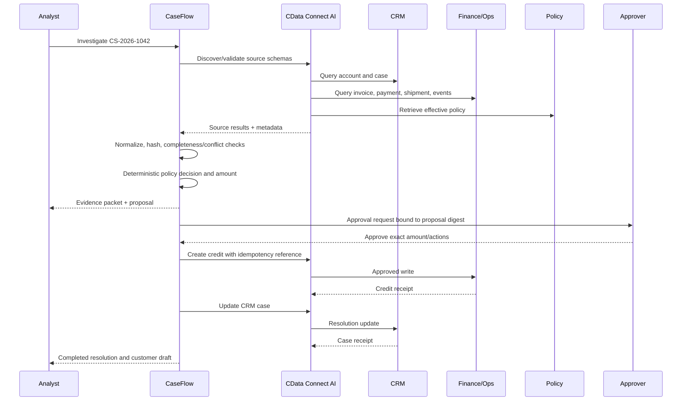

# Data Flow

```mermaid
sequenceDiagram
    participant U as Analyst
    participant CF as CaseFlow
    participant CD as CData Connect AI
    participant CRM as CRM
    participant FO as Finance/Ops
    participant P as Policy
    participant A as Approver

    U->>CF: Investigate CS-2026-1042
    CF->>CD: Discover/validate source schemas
    CD->>CRM: Query account and case
    CD->>FO: Query invoice, payment, shipment, events
    CD->>P: Retrieve effective policy
    CD-->>CF: Source results + metadata
    CF->>CF: Normalize, hash, completeness/conflict checks
    CF->>CF: Deterministic policy decision and amount
    CF-->>U: Evidence packet + proposal
    CF->>A: Approval request bound to proposal digest
    A-->>CF: Approve exact amount/actions
    CF->>CD: Create credit with idempotency reference
    CD->>FO: Approved write
    FO-->>CD: Credit receipt
    CF->>CD: Update CRM case
    CD->>CRM: Resolution update
    CRM-->>CD: Case receipt
    CF-->>U: Completed resolution and customer draft
```

## Data minimization

The optional model receives normalized facts and policy excerpts, not source credentials, unrestricted schemas, full account history, or unnecessary PII.
