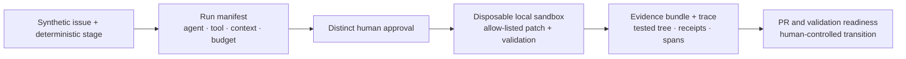

# Principal/staff walkthrough: one governed delivery chain

## Purpose and evidence boundary

This is a designed **seven-minute presentation timebox**, not a measured delivery-performance metric. It demonstrates one coherent authorization and evidence chain rather than every screen in the product.

The public browser is static. It can exercise the typed workflow reducer, deterministic context selector, policy evaluator, browser-local approval journal, exports, and deep links. It cannot run Docker, invoke a model, or write to Jira or GitHub. The sandbox and trace screens replay checked-in evidence from an explicitly invoked local command over the repository-owned synthetic toy repository.

The recorded Docker evidence identifies:

- run `sandbox-20260717t205034-9f48102b`;
- source commit `4d27eee7eafb9135a8529877d262d3e13ac523da` with the source working tree labeled `CLEAN`;
- tested repository tree digest `03fdf54fb8de0e13baf450bbfccd611f778a05a0141fef6e1a0e0be8b4c72917`;
- provider `LOCAL_DOCKER`;
- outcome `SUCCEEDED`; and
- approval outcome `PREAPPROVED_SYNTHETIC_FIXTURE`.

The browser-local Code Reviewer decision is a functional replay of the same approval policy over the same repository-owned patch fixture. It is deliberately not presented as the approval consumed by that historical Docker run.

## Walkthrough architecture

Text alternative: one synthetic issue selects an approved agent, tool, context pack, and execution budget. A distinct scoped person must approve the bound high-risk action. An explicitly invoked local command can then operate on a disposable, allow-listed toy repository and attach validation receipts to a tested tree. The static browser displays the checked-in evidence and keeps the final PR/validation transition under human control.

## Presenter preparation

1. Use a desktop viewport at least 1024 pixels wide; the workbench intentionally provides a concise case-study fallback on narrower screens.
2. Open the case study at `/` and choose **Start principal walkthrough · 7 min**.
3. Choose **Reset demo** and confirm if a previous browser-local approval exists. Reset restores the deterministic baseline.
4. Do not run a live sandbox, model gateway, E2B session, or external integration during the public walkthrough.
5. If interrupted, copy the current step link or reload it. `walkthrough=principal` and the named `tourStep` restore the presenter card and target screen.

## Seven-minute script

| Time      | Step and deep link                                                                                                                            | Show                                                                                                                                                                                                                                                                                            | Principal-level point                                                                                                                                                                                                                                                                     |
| --------- | --------------------------------------------------------------------------------------------------------------------------------------------- | ----------------------------------------------------------------------------------------------------------------------------------------------------------------------------------------------------------------------------------------------------------------------------------------------- | ----------------------------------------------------------------------------------------------------------------------------------------------------------------------------------------------------------------------------------------------------------------------------------------- |
| 0:00–0:35 | [1 · Thesis](../demo/?walkthrough=principal&tourStep=thesis)                                                                                  | Read the hero subtitle and functional/simulated boundary, then start the tour.                                                                                                                                                                                                                  | The thesis is governed delivery, not uncontrolled code generation. Authorization, context, tools, human decisions, and evidence are product concerns.                                                                                                                                     |
| 0:35–1:15 | [2 · Workflow](../demo/?walkthrough=principal&tourStep=workflow&screen=issue&issue=FIN-1077&stage=review)                                     | Open synthetic issue `FIN-1077`; scan Seed → Intake → Spec → Plan → Change Targets → Implement → Verify → PR Review.                                                                                                                                                                            | Each stage emits a reviewable artifact or state transition. Failures and stale upstream bindings block downstream readiness.                                                                                                                                                              |
| 1:15–2:05 | [3 · Capabilities](../demo/?walkthrough=principal&tourStep=capabilities&screen=control-plane&registry=agents&resource=agent.implementation)   | Inspect **Implementation Agent**: approved version/hash, allowed tools and write paths, model/context policies, tool-call/repair/time/token/cost ceilings. Choose **Tools**, then **Controlled patch application** to show `HIGH` risk, `src/**`, network denied, timeout, and approval policy. | A run resolves immutable capability contracts before execution. Token/cost values on the card are policy ceilings or estimates, not measured usage.                                                                                                                                       |
| 2:05–2:50 | [4 · Context Manifest](../demo/?walkthrough=principal&tourStep=context-manifest&screen=issue&issue=FIN-1077&stage=implement&context=manifest) | Inspect included and excluded records, selection reasons, provenance, TTL/freshness, estimated tokens, policy/agent hashes, and pack digest.                                                                                                                                                    | Deterministic retrieval is inspectable and replayable. The project does not claim semantic/vector retrieval. A selected record or policy change invalidates dependent work.                                                                                                               |
| 2:50–3:25 | [5 · Sandbox replay](../demo/?walkthrough=principal&tourStep=sandbox-replay&screen=trace&traceFocus=run)                                      | Read run ID, provider, exact source commit, tested-tree digest, and browser boundary.                                                                                                                                                                                                           | This is validated recorded evidence from a real local Docker run over synthetic inputs, not live visitor execution. The evidence identifies its exact source state, including a modified working tree.                                                                                    |
| 3:25–4:05 | [6 · Approval pause](../demo/?walkthrough=principal&tourStep=approval-pause&screen=approvals&approvalReplay=controlled-patch)                 | Choose **Create high-risk approval replay**. Inspect `WAITING_FOR_APPROVAL`, tool/version, target `src/report.js`, policy, arguments hash, change-target digest, context digest, and synthetic diff.                                                                                            | The high-risk tool call pauses before invocation. The browser writes an inspectable local decision record; it does not patch the file.                                                                                                                                                    |
| 4:05–4:45 | [7 · Reviewer decision](../demo/?walkthrough=principal&tourStep=reviewer-decision&screen=approvals&approvalReplay=controlled-patch)           | Switch to **Code Reviewer · Synthetic persona**, inspect the diff, enter `Reviewed bounded synthetic diff and allow-listed path.`, and approve.                                                                                                                                                 | A distinct synthetic human persona owns the decision. The AI Review Assistant never approves, and approval alone does not execute the action.                                                                                                                                             |
| 4:45–5:10 | [8 · Separation of duties](../demo/?walkthrough=principal&tourStep=duty-boundaries&screen=approvals&approvalReplay=controlled-patch)          | Read the domain-result matrix.                                                                                                                                                                                                                                                                  | Author/Implementer is blocked by self-approval policy; Platform Administrator is not an allowed approver; Code Reviewer is eligible through the required persona and `diff:review` scope. These results come from shared domain logic and are enforced again when recording the decision. |
| 5:10–5:55 | [9 · Evidence bundle](../demo/?walkthrough=principal&tourStep=evidence-bundle&screen=approvals&approvalReplay=controlled-patch)               | Choose **Resume replay into recorded evidence**. Open the evidence JSON/Markdown/trace links and the unified diff.                                                                                                                                                                              | The public transition opens a separate checked-in Docker recording. It shows the controlled patch, expected failing pre-test, passing post-patch build/tests, file hashes, cleanup, and evidence digest without claiming browser execution.                                               |
| 5:55–6:25 | [10 · Trace and budgets](../demo/?walkthrough=principal&tourStep=trace-budgets&screen=trace&traceFocus=waterfall)                             | Identify `agent.invoke`, `tool.call`, `approval.wait`, `sandbox.execute`, `validation.command`, and `evidence.finalize`; read duration, three tool calls, one repair attempt, and budget status.                                                                                                | There is intentionally no `model.call`: no model was used. Model calls/tokens/cost are exact zero. Durations are measured; counters are exact; configured limits are policy values.                                                                                                       |
| 6:25–6:45 | [11 · Readiness gates](../demo/?walkthrough=principal&tourStep=readiness-gates&screen=github&issue=FIN-1077)                                  | Inspect changed-file classification, diff review, checks, reviewer state, and release gates; optionally open Validation Evidence.                                                                                                                                                               | Normal branch/PR controls remain authoritative. Jira/GitHub records and writes are simulated; guard evaluation and browser-local state are functional. AI never makes the final decision.                                                                                                 |
| 6:45–7:00 | [12 · Boundaries and provenance](../demo/?walkthrough=principal&tourStep=boundaries-provenance&screen=architecture)                           | Close on the four planes, productionization boundary, and clean-room statement.                                                                                                                                                                                                                 | Production still needs real identity, durable shared approvals, managed secrets, stronger isolation/attestation, operations, and incident handling. The public prototype is independent and synthetic.                                                                                    |

## Sixty-second abbreviated version

1. **0:00–0:10 — Thesis:** “Generation is easy to demo; governed delivery requires authorization, bounded context/tools, human decisions, and commit-bound evidence.”
2. **0:10–0:22 — Manifest:** Open [Capabilities](../demo/?walkthrough=principal&tourStep=capabilities&screen=control-plane&registry=agents&resource=agent.implementation) and point to approved agent/tool versions, write boundary, approval policy, and budgets.
3. **0:22–0:32 — Context:** Open the [Context Manifest](../demo/?walkthrough=principal&tourStep=context-manifest&screen=issue&issue=FIN-1077&stage=implement&context=manifest) and point to one inclusion, one exclusion, freshness, and digest.
4. **0:32–0:45 — Human gate:** Open the [Approval replay](../demo/?walkthrough=principal&tourStep=approval-pause&screen=approvals&approvalReplay=controlled-patch), explain the pause-before-write contract and separation-of-duties matrix. Do not spend time entering a decision.
5. **0:45–0:55 — Evidence:** Open the [Run Trace](../demo/?walkthrough=principal&tourStep=trace-budgets&screen=trace&traceFocus=waterfall), identify sandbox/validation/approval spans, exact-zero model usage, budgets, and source/tested-tree hashes.
6. **0:55–1:00 — Boundary:** “The browser is static; Jira/GitHub/model writes are simulated; the Docker recording is real local evidence over synthetic fixtures; production identity and durable approvals remain explicit future work.”

## Fifteen-minute deep dive

Use the same twelve-step order and add these drills:

- **Workflow (2 minutes):** redo Plan in the clean-walkthrough scenario and show Change Targets, Implement, Verify, and Review becoming stale. Contrast invalidation with optimistic continuation.
- **Registry (2 minutes):** compare agent and tool lifecycle status, version/hash provenance, allowed stages, idempotency, network policy, and JSON Schema. Explain why the registry is stage-specific rather than a marketplace.
- **Context (2 minutes):** expand an excluded revoked/stale/unauthorized record, explain deterministic priority ordering and token truncation, then simulate a selected context revision to show stale propagation.
- **Approval (3 minutes):** demonstrate Author/Implementer and Platform Administrator blocks before selecting Code Reviewer. Explain hash-bound arguments, tool/agent versions, context/change-target digests, event chaining, timeout, decision-cache TTL, and resume revalidation.
- **Sandbox evidence (2 minutes):** inspect the unified diff, pre-patch expected failure, post-patch build/test receipts, network-disabled Docker metadata, non-root/resource controls, changed-file hashes, and cleanup. State the host-kernel/daemon residual risk.
- **Trace and budgets (2 minutes):** expand safe span attributes, identify the budget-approaching event for one repair attempt, and explain why prompt/source bodies are excluded. Contrast measured duration, exact counters, estimates, and provider-reported usage.
- **Productionization (2 minutes):** discuss authenticated identity, transactional append-only approvals, signed/attested evidence, isolated execution, scoped secrets, idempotency, observability, rollback, and incident response. Keep these labeled as proposed production design.

## Claim taxonomy for the presenter

| Category                          | Safe examples in this walkthrough                                                                                                                                                                                                                                             |
| --------------------------------- | ----------------------------------------------------------------------------------------------------------------------------------------------------------------------------------------------------------------------------------------------------------------------------- |
| Functional repository behavior    | Typed transitions and guards; deterministic context selection/digests; browser-local approval journal; role/scope/self-approval checks; deep links; evidence validation; local CLI contracts.                                                                                 |
| Measured real local evidence      | Recorded Docker command durations, exit codes, hashes, changed-file count, cleanup receipt, trace timing, and exact controller counters for the named evidence run.                                                                                                           |
| Synthetic fixture or policy value | Issue/PR/check/persona data; approval replay; 30-minute timeout; tool/token/cost ceilings; the designed seven-minute timebox.                                                                                                                                                 |
| Approved professional context     | “In professional work, I built a related governed AI-assisted delivery platform that supported approximately 50 production stories through human-reviewed pull requests. This public prototype is a separate implementation and contains none of that system’s code or data.” |
| Proposed production design        | Real identity, shared durable approvals, secrets, stronger isolation/attestation, hosted observability, rollback, and incident handling.                                                                                                                                      |

Never describe synthetic issue metrics as measured, the browser approval as authenticated identity, the browser replay as Docker execution, exact-zero no-model accounting as an estimate, or the AI Review Assistant as a human decision-maker.

## Recovery and interruption handling

- **Wrong state:** choose **Reset demo**, confirm, and reopen the current named step link.
- **Existing approval:** reset before step 6. The tour otherwise reports the existing request state rather than silently replacing history.
- **Accidental navigation:** the named `tourStep` remains in the URL; choose **Open this step**.
- **Clipboard denied:** copy the visible URL manually; the tour continues.
- **Evidence unavailable:** stop the evidence claim. Do not substitute a fabricated run. Validate tracked evidence with `npm run sandbox:evidence:validate` before presenting.
- **Narrow viewport:** present the responsive case study or widen the browser; the workbench intentionally avoids a broken scaled-down dashboard.

## Closing statement

Independent portfolio prototype. All code, copy, fixtures, workflows, and visuals in this project were created from scratch using synthetic data. No employer or client code, prompts, schemas, screenshots, repositories, internal documentation, or confidential information were used. External Jira, GitHub, AI, database, and MCP-style operations are simulated; the interactive UI and local workflow state machine are functional.
